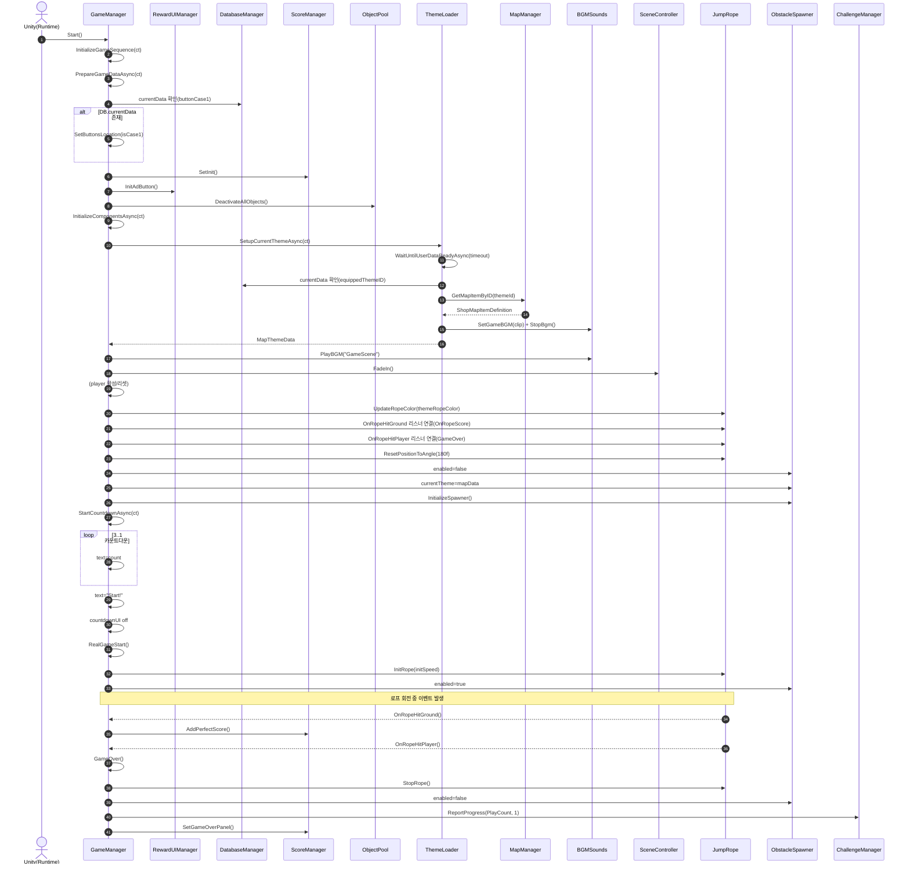

# 목차

| [✈️ 프로젝트 소개(개발환경) ](#airplane-프로젝트-소개) |
| :---: |
| [✋ 팀 소개 ](#hand-팀-소개) |
| [🌟 주요기능 ](#star2-주요기능) |
| [☑️ 기술 스택 ](#ballot_box_with_check-기술-스택) |
| [🕸️ 와이어프레임 ](#spider_web-와이어프레임) |
| [📓 UML ](#uml) |

#

# JumpRoooooope
[필요하면 사진 넣기]

## 📖 게임 소개
### "동물 친구들과 함께 떠나는 신나는 줄넘기 여행!"

세상에서 가장 귀여운 블록 동물들이 큐브 세상에 모였습니다. 기린, 토끼, 곰, 펭귄까지! 신나는 리듬에 맞춰 줄을 넘고, 장애물을 피해 한계를 돌파하는 무한 점프 액션 게임입니다.

- 개발 환경: Unity 6000.3.2f1   Visual Studio Community 2022, Visual Studio Code
- 플랫폼: Mobile (Android)
- 장르: 캐주얼 점프 액션 / 아케이드
- 개발 기간: 2026.01.08 ~ 2026.03.05 (Android PlayStore 비공개 테스트 진행 中)

## 📺시연 영상
### [📺YouTube Link]

 

[:ringed_planet: 목차로 돌아가기](#목차)

  

## :hand: 팀 소개

| 이름 | 담당 업무 | 깃허브 주소 | 이메일 |
| :---: | :---: | :---: | :---: |
| 이경현 | MapTile, 유닛 생성 시 배치, 유닛 이동 및 애니메이션 | https://github.com/YooSeungA52 | https://velog.io/@seunga52/posts |
| 최세은 | GameManager, 몬스터 소환 및 직렬화를 활용한 스테이지 구성, 몬스터 애니메이터 배치 | https://github.com/Kaldorei00910 | https://velog.io/@c00kie/posts |

[:ringed_planet: 목차로 돌아가기](#목차)

  

## :star2: 주요기능

### 1. 로그인 기능
[필요하면 사진 넣기]

- 게임시작 버튼을 누르면 디펜스 게임을 즐길 수 있습니다.
- 게임설명 버튼을 눌러서 게임의 조작법과 유닛, 몬스터 간의 상성을 확인할 수 있습니다.

## Lobby Scene
### 1. 상점 기능
[필요하면 사진 넣기]

- 게임시작 버튼을 누르면 디펜스 게임을 즐길 수 있습니다.
- 게임설명 버튼을 눌러서 게임의 조작법과 유닛, 몬스터 간의 상성을 확인할 수 있습니다.

### 2. 도전 과제 기능
[필요하면 사진 넣기]

- 게임시작 버튼을 누르면 디펜스 게임을 즐길 수 있습니다.
- 게임설명 버튼을 눌러서 게임의 조작법과 유닛, 몬스터 간의 상성을 확인할 수 있습니다.

### 3. 랭킹 기능
[필요하면 사진 넣기]

- 게임시작 버튼을 누르면 디펜스 게임을 즐길 수 있습니다.
- 게임설명 버튼을 눌러서 게임의 조작법과 유닛, 몬스터 간의 상성을 확인할 수 있습니다.

## Game Scene
### 1. 도전 과제 기능
[필요하면 사진 넣기]

- 게임시작 버튼을 누르면 디펜스 게임을 즐길 수 있습니다.
- 게임설명 버튼을 눌러서 게임의 조작법과 유닛, 몬스터 간의 상성을 확인할 수 있습니다.

### 2. 장애물 시스템
[필요하면 사진 넣기]

- 게임시작 버튼을 누르면 디펜스 게임을 즐길 수 있습니다.
- 게임설명 버튼을 눌러서 게임의 조작법과 유닛, 몬스터 간의 상성을 확인할 수 있습니다.

#### 2-1. 통나무
[필요하면 사진 넣기]

- 게임시작 버튼을 누르면 디펜스 게임을 즐길 수 있습니다.
- 게임설명 버튼을 눌러서 게임의 조작법과 유닛, 몬스터 간의 상성을 확인할 수 있습니다.
- 
#### 2-2. 화살
[필요하면 사진 넣기]

- 게임시작 버튼을 누르면 디펜스 게임을 즐길 수 있습니다.
- 게임설명 버튼을 눌러서 게임의 조작법과 유닛, 몬스터 간의 상성을 확인할 수 있습니다.

 

[:ringed_planet: 목차로 돌아가기](#목차)

  

## :ballot_box_with_check: 기술 스택

[필요하면 사진 넣기]

 

[:ringed_planet: 목차로 돌아가기](#목차)

  

## :spider_web: 와이어프레임

[필요하면 사진 넣기]

 

[:ringed_planet: 목차로 돌아가기](#목차)

  

## :notebook: UML

### ■ 클래스 다이어그램

### ■ 시퀀스 다이어그램

[:ringed_planet: 목차로 돌아가기](#목차)

  

