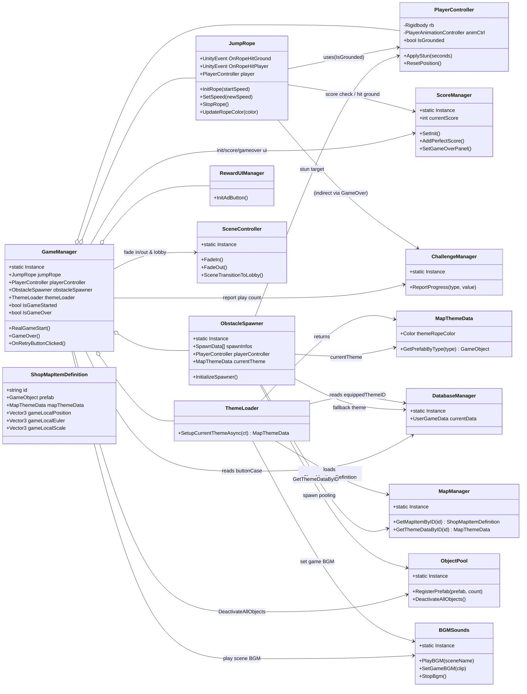
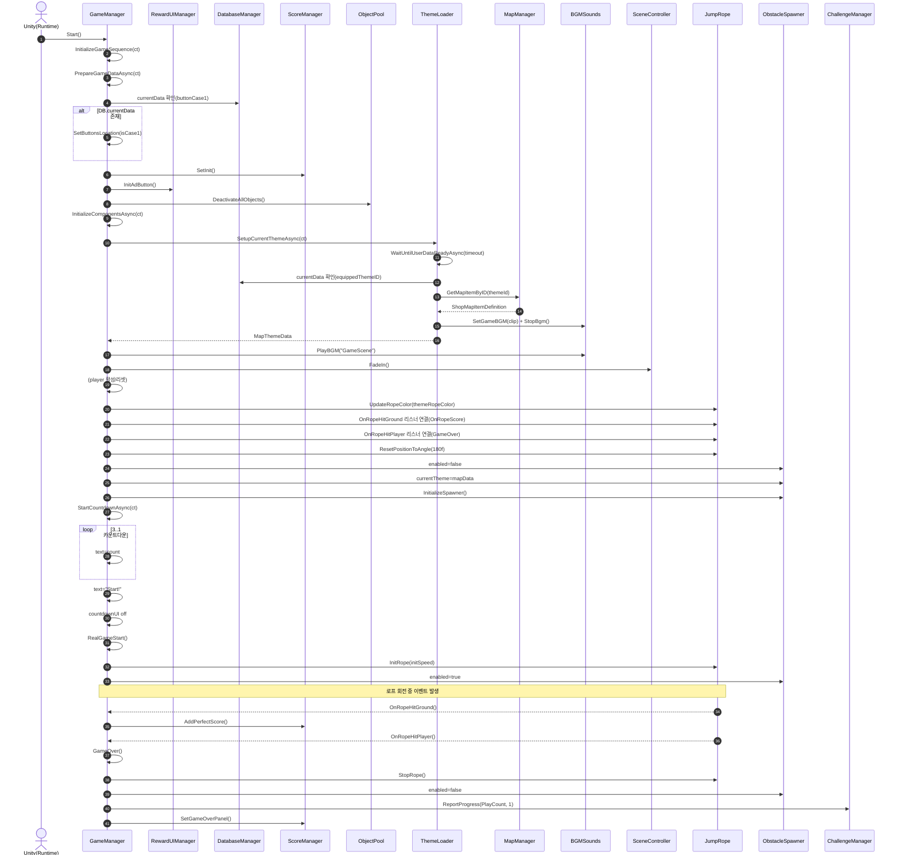

# 목차

| [✈️ 프로젝트 소개(개발환경) ](#airplane-프로젝트-소개) |
| :---: |
| [✋ 팀 소개 ](#hand-팀-소개) |
| [🌟 주요기능 ](#star2-주요기능) |
| [☑️ 기술 스택 ](#ballot_box_with_check-기술-스택) |
| [📓 UML ](#uml) |

#

# JumpRoooooope

<h4>👾게임 흐름도

## 📖 게임 소개
### "동물 친구들과 함께 떠나는 신나는 줄넘기 여행!"

세상에서 가장 귀여운 블록 동물들이 큐브 세상에 모였습니다. 기린, 토끼, 곰, 펭귄까지! 신나는 리듬에 맞춰 줄을 넘고, 장애물을 피해 한계를 돌파하는 무한 점프 액션 게임입니다.

- **개발 환경**: Unity 6000.3.2f1   Visual Studio Community 2022, Visual Studio Code
- **플랫폼**: Mobile (Android)
- **장르**: 캐주얼 점프 액션 / 아케이드
- **개발 기간**: 2026.01.08 ~ 2026.03.05 (Google PlayStore 비공개 테스트 진행 中)

## 📺시연 영상
### [📺YouTube Link]

 

[:ringed_planet: 목차로 돌아가기](#목차)

  

## :hand: 팀 소개

| 이름 | 담당 업무 | 깃허브 주소 | 이메일 |
| :---: | :---: | :---: | :---: |
| 이경현 | 상점 관련 기능, 캐릭터 관련 기능, 초기 생성 | https://github.com/gstk0009 | gstk0009@naver.com |
| 최세은 | 로그인/로그아웃/회원탈퇴, 도전과제, 줄 돌리기, 장애물(통나무,잉크) LevelPlay 광고, 유저 데이터 관리 | https://github.com/Choiseeun0815 | https://stephan-y.tistory.com/ 

[:ringed_planet: 목차로 돌아가기](#목차)

  

## :star2: 주요기능
## Login Scene

<h4>🔒로그인 기능

#### 로그인 및 온보딩 (Auth & Data)
- Firebase Auth & Google Sign-In을 사용한 사용자 인증 기능.
- OAuth 2.0 및 싱글톤 방식으로 세션 유지 및 회원 탈퇴 수행.
- Firebase Firestore를 사용한 데이터 동기화 기능.
- 비동기 CRUD 방식으로 유저 프로필 및 게임 데이터 실시간 저장 수행.
- Regex & 텍스트 필터를 사용한 닉네임 검증 기능.
- 조건 검사 및 DB 중복 쿼리 방식으로 유효한 계정 생성 수행.

## Lobby Scene

<h4>🎁 상점 기능</h4>

### 상점 시스템 (Shop)

- ScriptableObject 기반의 **아이템 정의(Item Definition)**, **맵 전용 정의(Map Item Definition)**,  
  **카탈로그(Catalog)** 구조를 사용하여 캐릭터와 맵 데이터를 분리 관리하도록 설계했습니다.
- **캐릭터 / 맵 탭 분리형 UI**를 통해 카테고리별 아이템을 직관적으로 탐색할 수 있습니다.
- 각 아이템은 **고정 해금**과 **랜덤 해금** 방식으로 구매할 수 있으며,  
  보유 여부와 재화 상태를 반영하여 UI에 즉시 표시되도록 구성했습니다.
- 선택한 아이템은 **미리보기(Preview) 시스템**을 통해 실시간으로 확인할 수 있으며,  
  캐릭터와 맵의 특성에 따라 서로 다른 카메라 구도를 적용했습니다.
- 해금한 아이템은 즉시 **장착(Equip)** 할 수 있으며,  
  선택 정보가 저장되어 다음 접속 시에도 유지되도록 구현했습니다.

#### 주요 구현 요소
- **ShopItemDefinition / ShopMapItemDefinition**
  - ScriptableObject를 활용하여 캐릭터와 맵 데이터를 분리 정의
  - 아이템별 프리팹, 썸네일, 가격, 미리보기 설정 등을 개별적으로 관리

- **ShopCatalog**
  - 상점에서 사용하는 전체 아이템 목록을 카테고리 기준으로 관리

- **ShopManager**
  - 해금, 랜덤 뽑기, 장착, 재화 차감 등 상점 핵심 로직 담당

- **ShopUIController**
  - 탭 전환, 아이템 목록 갱신, 선택 상태 반영, 프리뷰 갱신 등 UI 흐름 제어

- **ShopPreviewStage**
  - RenderTexture 기반 3D 미리보기 제공
  - 캐릭터는 **AutoFit**, 맵은 **FixedPose** 방식으로 출력

- **ShopPopupUI**
  - 아이템 상세 정보 표시, 고정 해금, 선택 적용 처리

#### 핵심 포인트
- 캐릭터와 맵 데이터를 분리 정의하여 **확장성과 관리 효율을 높였습니다**
- 공통 상점 로직과 개별 아이템 데이터를 분리하여 **유지보수성을 개선했습니다**
- 미리보기, 잠금 상태, 선택 적용 흐름을 분리하여 **UI와 로직의 역할을 명확히 구분했습니다**

<h4>🏆도전 과제 기능

#### 도전 과제 시스템 (Challenge)
- ScriptableObject & 이벤트 시스템을 사용한 도전 과제 기능.
- 타입별 리포팅 방식으로 업적 트래킹 및 보상 해금 수행.
- DOTween & 프리팹 동적 생성을 사용한 내비게이션 및 알림 기능.
- 패널 슬라이드 및 실시간 배지 방식으로 화면 전환 및 보상 알림 수행.

<h4>📊랭킹 기능

#### 랭킹 시스템 (Ranking)
- Firestore Query를 사용한 실시간 랭킹 기능.
- 내림차순 정렬 및 조건부 카운팅 방식으로 리더보드 집계 및 내 순위 산출 수행.
- TextMeshPro & Sprite Manager를 사용한 순위 시각화 기능.
- 등수별 컬러링 및 DB에 등록된 커스텀 아이콘 매칭 방식으로 항목 연출 수행.

<h4>👤 유저 아이콘 시스템

#### 유저 프로필 아이콘 시스템 (User Icon System)
- Dictionary & IconCatalog를 사용한 아이콘 데이터 관리 기능. ID 기반의 매핑 및 싱글톤 방식으로, 시스템 전역에서 아이콘 정보(스프라이트, 배경색 등)를 빠르게 조회하고 초기화를 수행.
- IconSlotUI & ProfilePopupUI를 사용한 커스텀 프로필 선택 기능. 델리게이트 콜백 및 동적 슬롯 생성 방식으로, 아이콘 해금 상태에 따른 시각적 피드백과 실시간 프리뷰 업데이트를 수행.
- UserIconManager를 사용한 아이콘 해금 및 장착 로직 기능. 리스트 포함 여부 검사 및 기본 아이콘 자동 해금 방식으로, 데이터베이스(DB)와의 연동을 통한 영구적인 프로필 상태 관리를 수행.
- FirestoreData & UserGameData를 사용한 프로필 데이터 모델링 기능. 프로퍼티 기반 데이터 매핑 방식으로, 장착한 아이콘 ID 및 해금 목록 정보를 클라우드 서버와 실시간으로 동기화를 수행.

## Game Scene

<h4>🦒 캐릭터 관련 기능</h4>

  
### 플레이어 시스템 (Player)

- 플레이어 기능은 **입력(Input)**, **이동(Move)**, **상태(State)**, **애니메이션(Animation)** 을  
  각각 분리한 구조로 설계하여 역할을 명확히 나누었습니다.
- `PlayerController`를 중심으로 각 전용 컨트롤러를 연결하여  
  플레이어의 이동, 점프, 피격, 애니메이션 재생 흐름을 통합 관리하도록 구성했습니다.
- 점프는 **코요테 타임(Coyote Time)** 과 **점프 버퍼(Jump Buffer)** 를 적용하여  
  조작감을 부드럽게 보정했습니다.
- 피격 시에는 **스턴 상태**를 부여하고 입력을 강제로 해제하여  
  일정 시간 동안 행동이 제한되도록 구현했습니다.
- 이동 상태와 피격 상태에 따라 **Idle / Run / Hit** 애니메이션이 자동으로 전환되도록 구성했습니다.

#### 이동
- `PlayerMoveController`에서 Rigidbody 기반 이동과 점프를 담당합니다.
- 좌우 목표 지점을 기준으로 이동하도록 구성하여 캐릭터가 정해진 범위 안에서 자연스럽게 움직이도록 구현했습니다.
- Raycast 기반 지면 체크를 통해 착지 여부를 판별하고, 공중에서는 상승/하강 구간에 따라 서로 다른 중력을 적용했습니다.
- 점프 높이, 체공 시간, 상승 비율을 기준으로 실제 점프 속도와 중력값을 자동 계산하도록 설계했습니다.

#### 입력
- `PlayerInputController`에서 좌우 이동, 점프 입력 상태를 분리 관리합니다.
- `Held` 상태와 `ThisFrame` 성격의 순간 입력을 구분하여 물리 처리 타이밍과 안정적으로 연결했습니다.
- 좌우 입력은 동시에 유지되지 않도록 처리하여 한 방향 입력만 유효하게 동작하도록 구성했습니다.
- 스턴, 리셋, 게임오버 상황에서는 모든 입력을 즉시 초기화할 수 있도록 했습니다.

#### 애니메이션
- `PlayerAnimationController`에서 플레이어 애니메이션 재생을 전담합니다.
- `Idle`, `Hit`는 고정 상태명을 사용하고, 이동 애니메이션은 Animator의 Clip 이름을 기반으로  
  `Run`, `Walk`, `Fly Inplace` 중 가능한 애니메이션을 자동 선택하도록 구성했습니다.
- 같은 애니메이션이 반복 재생되지 않도록 캐시를 두어 불필요한 재생 호출을 방지했습니다.
- 이동 중에는 Run, 정지 시에는 Idle, 스턴 시에는 Hit 애니메이션이 출력되도록 연결했습니다.

#### 상태
- `PlayerStateController`에서 플레이어의 상태를 관리하며, 현재는 **스턴(Stun)** 상태를 구현했습니다.
- 스턴이 적용되면 일정 시간 동안 이동과 점프를 제한하고, 시간이 지나면 자동으로 해제되도록 구성했습니다.
- 비동기 처리(UniTask)를 활용하여 스턴 지속 시간을 관리하고, 중복 적용이나 해제 충돌을 방지했습니다.
- 이후 무적, 슬로우 등 추가 상태 효과를 확장할 수 있도록 분리형 구조로 설계했습니다.

#### 주요 구현 요소
- **PlayerController**
  - 입력, 이동, 상태, 애니메이션을 연결하는 메인 컨트롤러
  - 점프 시 효과음 재생 및 줄넘기 판정 처리 수행

- **PlayerInputController**
  - 좌우 이동 및 점프 입력 상태 보관
  - 순간 입력과 유지 입력을 분리 관리

- **PlayerMoveController**
  - Rigidbody 기반 이동, 점프, 지면 체크, 중력 처리 담당
  - 코요테 타임과 점프 버퍼를 적용한 점프 보정 제공

- **PlayerAnimationController**
  - Idle / Run / Hit 애니메이션 재생 제어
  - Animator Clip 캐싱을 통한 자동 locomotion 선택 처리

- **PlayerStateController**
  - 스턴 상태 적용 및 해제 관리
  - 상태 초기화 및 비동기 제어 담당

#### 핵심 포인트
- 입력, 이동, 상태, 애니메이션을 분리하여 **유지보수성과 확장성을 높였습니다**
- 점프 보정 시스템을 적용하여 **플레이 감각을 개선했습니다**
- 상태 변화에 따라 입력 제한과 애니메이션 전환이 자연스럽게 이어지도록 구성했습니다

<h4>➰ 줄 돌리기 기능

#### 줄넘기 및 회전 로직 (Jump Rope Mechanics)
- LineRenderer & Quadratic Bezier를 사용한 줄(Rope) 시뮬레이션 기능.
  - 베지어 보간 및 제어점(Control Point) 연산 방식으로, 회전하는 줄의 부드러운 곡선 형태를 수행.
- 각도 정규화 및 특정 범위(Collision Zone) 진입 체크 방식으로, 플레이어와의 충돌 및 점프 성공 판정을 수행. → Physics를 통해 충돌 체크하는 방식에서 최적화.
- 실시간 네온 컬러 업데이트 및 바닥 좌표(Y) 제한 방식으로, 시각적 몰입감 및 지면 접촉 시각화를 수행.
- 성공 각도 판정(Perfect, Bad) 및 확률형 장애물(먹물) 트리거 방식으로, 점수 가산 및 게임 난이도 조절을 수행.

<h4>📦 장애물 스폰 시스템

#### 장애물 스폰 시스템 (Obstacle Spawn System)
- Dictionary & Queue를 사용한 범용 오브젝트 풀링(Object Pooling) 기능으로, Enqueue/Dequeue 방식으로 빈번한 객체 생성 및 파괴에 따른 가비지 컬렉션 부하를 방지하고 성능 최적화를 수행.
- Score-based Spawn Logic을 사용한 동적 난이도 조절 기능으로, Score Decay 및 Interval Clamping 방식으로 점수 상승에 따른 장애물 스폰 간격 단축 및 난이도 조정을 수행.
- Theme Data Mapping을 사용한 테마별 프리팹 자동 교체 기능으로, MapThemeData와 ObstacleType을 통해 현재 장착된 테마에 적합한 장애물 모델을 실시간으로 주입하여 수행.
- BoxCollider Area & Bounds를 사용한 구역 기반 랜덤 배치 기능으로, Random.Range 연산을 통해 설정된 스폰 영역 내 임의의 좌표에 장애물을 배치함으로써 수행.

#

#### 🪵2-1. 통나무
- Rigidbody 및 IObstacle 인터페이스를 사용한 구르는 통나무(Rolling Log) 기능.
- 랜덤 스피드 및 Y축 스케일 가변 설정 방식으로, 물리 기반의 동적인 장애물 투척 및 충돌 판정을 수행.

#

#### ✒️2-2. 잉크

<h4>장애물 잉크

- DOTween Sequence 및 Image Alpha Fade를 사용한 잉크 화면 가림(Ink Splatter) 기능.
- Show/Sustain/Hide 타임라인 제어 방식으로, 플레이어의 시야를 일시적으로 차단하는 시각적 방해를 수행.

#

<h4>📢 광고 시스템

**[Unity LevelPlay]**

#### 광고 시스템 (Ad System)
- Unity LevelPlay SDK를 사용한 전면 광고(Interstitial) 기능. 누적 게임 횟수 체크(Frequency) 방식으로, 일정 판수마다 게임 종료 시점에 전면 광고 노출 및 광고 시청 도전 과제 카운트 수집을 수행.
- Unity LevelPlay SDK를 사용한 보상형 광고(Rewarded) 기능. 사용자 선택 및 재시청 쿨타임(Cooldown) 방식으로, 시청 완료 시 추가 골드 지급 또는 특정 챌린지 진행도 업데이트를 수행.
- UniTask 및 Particle System을 사용한 보상 UI 피드백 기능. 비동기 딜레이 및 코인 버스트(Coin Burst) 연출 방식으로, 보상 획득 시 시각적/청각적 효과 제공 및 실시간 데이터베이스 재화 갱신을 수행.

 

[:ringed_planet: 목차로 돌아가기](#목차)

  

## :ballot_box_with_check: 기술 스택

[필요하면 사진 넣기]

 

[:ringed_planet: 목차로 돌아가기](#목차)

  

## :notebook: UML

### ■ 클래스 다이어그램

### ■ 시퀀스 다이어그램

[:ringed_planet: 목차로 돌아가기](#목차)

  

