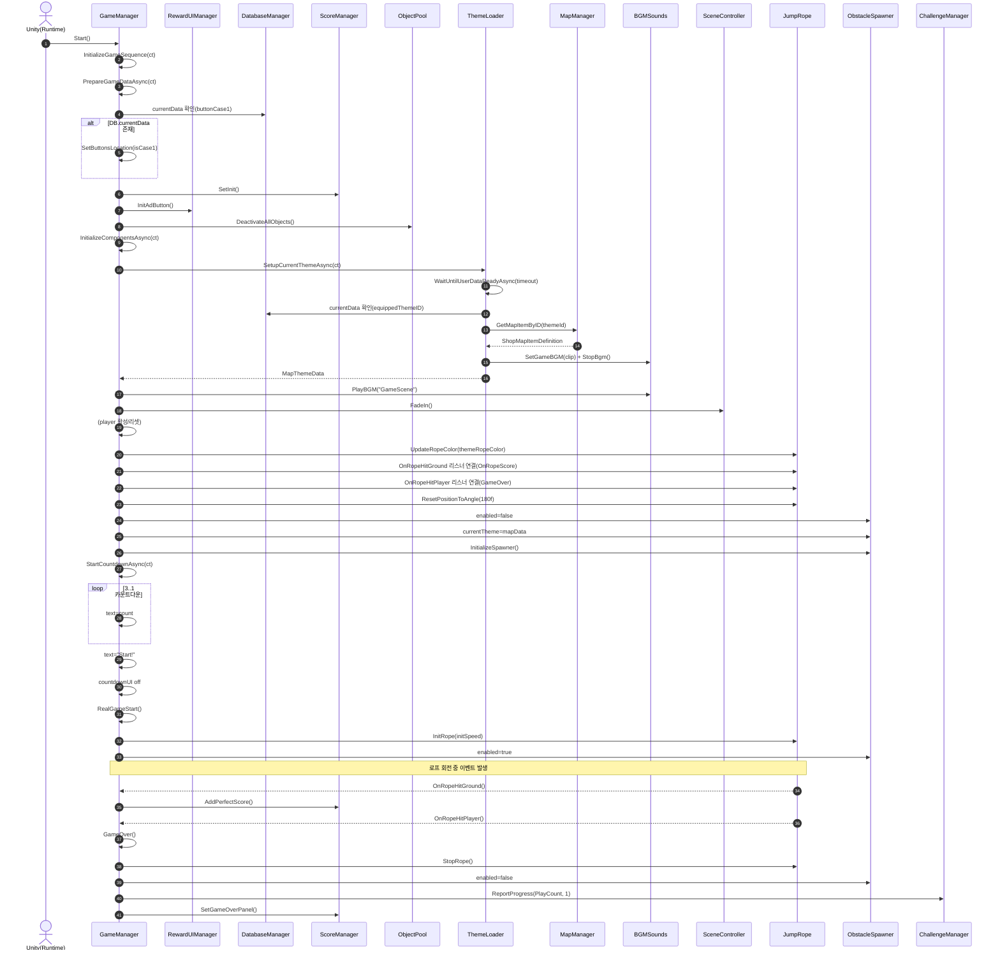

# 목차

| [✈️ 프로젝트 소개(개발환경) ](#airplane-프로젝트-소개) |
| :---: |
| [✋ 팀 소개 ](#hand-팀-소개) |
| [🌟 주요기능 ](#star2-주요기능) |
| [☑️ 기술 스택 ](#ballot_box_with_check-기술-스택) |
| [🕸️ 와이어프레임 ](#spider_web-와이어프레임) |
| [📓 UML ](#uml) |

#

# JumpRoooooope
[필요하면 사진 넣기]

## 📖 게임 소개
### "동물 친구들과 함께 떠나는 신나는 줄넘기 여행!"

세상에서 가장 귀여운 블록 동물들이 큐브 세상에 모였습니다. 기린, 토끼, 곰, 펭귄까지! 신나는 리듬에 맞춰 줄을 넘고, 장애물을 피해 한계를 돌파하는 무한 점프 액션 게임입니다.

- 개발 환경: Unity 6000.3.2f1   Visual Studio Community 2022, Visual Studio Code
- 플랫폼: Mobile (Android)
- 장르: 캐주얼 점프 액션 / 아케이드
- 개발 기간: 2026.01.08 ~ 2026.03.05 (Google PlayStore 비공개 테스트 진행 中)

## 📺시연 영상
### [📺YouTube Link]

 

[:ringed_planet: 목차로 돌아가기](#목차)

  

## :hand: 팀 소개

| 이름 | 담당 업무 | 깃허브 주소 | 이메일 |
| :---: | :---: | :---: | :---: |
| 이경현 | 상점 관련 기능, 캐릭터 관련 기능, 초기 생성 | https://github.com/gstk0009 | gstk0009@naver.com |
| 최세은 | GameManager, 몬스터 소환 및 직렬화를 활용한 스테이지 구성, 몬스터 애니메이터 배치 | https://github.com/Kaldorei00910 | https://velog.io/@c00kie/posts |

[:ringed_planet: 목차로 돌아가기](#목차)

  

## :star2: 주요기능

### 1. 로그인 기능
[필요하면 사진 넣기]

- 게임시작 버튼을 누르면 디펜스 게임을 즐길 수 있습니다.
- 게임설명 버튼을 눌러서 게임의 조작법과 유닛, 몬스터 간의 상성을 확인할 수 있습니다.

## Lobby Scene

<h4>🎁 상점 기능</h4>

### 상점 시스템 (Shop)

- ScriptableObject 기반의 **아이템 정의(Item Definition)**, **맵 전용 정의(Map Item Definition)**,  
  **카탈로그(Catalog)** 구조를 사용하여 캐릭터와 맵 데이터를 분리 관리하도록 설계했습니다.
- **캐릭터 / 맵 탭 분리형 UI**를 통해 카테고리별 아이템을 직관적으로 탐색할 수 있습니다.
- 각 아이템은 **고정 해금**과 **랜덤 해금** 방식으로 구매할 수 있으며,  
  보유 여부와 재화 상태를 반영하여 UI에 즉시 표시되도록 구성했습니다.
- 선택한 아이템은 **미리보기(Preview) 시스템**을 통해 실시간으로 확인할 수 있으며,  
  캐릭터와 맵의 특성에 따라 서로 다른 카메라 구도를 적용했습니다.
- 해금한 아이템은 즉시 **장착(Equip)** 할 수 있으며,  
  선택 정보가 저장되어 다음 접속 시에도 유지되도록 구현했습니다.

#### 주요 구현 요소
- **ShopItemDefinition / ShopMapItemDefinition**
  - ScriptableObject를 활용하여 캐릭터와 맵 데이터를 분리 정의
  - 아이템별 프리팹, 썸네일, 가격, 미리보기 설정 등을 개별적으로 관리

- **ShopCatalog**
  - 상점에서 사용하는 전체 아이템 목록을 카테고리 기준으로 관리

- **ShopManager**
  - 해금, 랜덤 뽑기, 장착, 재화 차감 등 상점 핵심 로직 담당

- **ShopUIController**
  - 탭 전환, 아이템 목록 갱신, 선택 상태 반영, 프리뷰 갱신 등 UI 흐름 제어

- **ShopPreviewStage**
  - RenderTexture 기반 3D 미리보기 제공
  - 캐릭터는 **AutoFit**, 맵은 **FixedPose** 방식으로 출력

- **ShopPopupUI**
  - 아이템 상세 정보 표시, 고정 해금, 선택 적용 처리

#### 핵심 포인트
- 캐릭터와 맵 데이터를 분리 정의하여 **확장성과 관리 효율을 높였습니다**
- 공통 상점 로직과 개별 아이템 데이터를 분리하여 **유지보수성을 개선했습니다**
- 미리보기, 잠금 상태, 선택 적용 흐름을 분리하여 **UI와 로직의 역할을 명확히 구분했습니다**

## Game Scene

<h4>🦒 캐릭터 관련 기능</h4>

  
### 플레이어 시스템 (Player)

- 플레이어 기능은 **입력(Input)**, **이동(Move)**, **상태(State)**, **애니메이션(Animation)** 을  
  각각 분리한 구조로 설계하여 역할을 명확히 나누었습니다.
- `PlayerController`를 중심으로 각 전용 컨트롤러를 연결하여  
  플레이어의 이동, 점프, 피격, 애니메이션 재생 흐름을 통합 관리하도록 구성했습니다.
- 점프는 **코요테 타임(Coyote Time)** 과 **점프 버퍼(Jump Buffer)** 를 적용하여  
  조작감을 부드럽게 보정했습니다.
- 피격 시에는 **스턴 상태**를 부여하고 입력을 강제로 해제하여  
  일정 시간 동안 행동이 제한되도록 구현했습니다.
- 이동 상태와 피격 상태에 따라 **Idle / Run / Hit** 애니메이션이 자동으로 전환되도록 구성했습니다.

#### 이동
- `PlayerMoveController`에서 Rigidbody 기반 이동과 점프를 담당합니다.
- 좌우 목표 지점을 기준으로 이동하도록 구성하여 캐릭터가 정해진 범위 안에서 자연스럽게 움직이도록 구현했습니다.
- Raycast 기반 지면 체크를 통해 착지 여부를 판별하고, 공중에서는 상승/하강 구간에 따라 서로 다른 중력을 적용했습니다.
- 점프 높이, 체공 시간, 상승 비율을 기준으로 실제 점프 속도와 중력값을 자동 계산하도록 설계했습니다.

#### 입력
- `PlayerInputController`에서 좌우 이동, 점프 입력 상태를 분리 관리합니다.
- `Held` 상태와 `ThisFrame` 성격의 순간 입력을 구분하여 물리 처리 타이밍과 안정적으로 연결했습니다.
- 좌우 입력은 동시에 유지되지 않도록 처리하여 한 방향 입력만 유효하게 동작하도록 구성했습니다.
- 스턴, 리셋, 게임오버 상황에서는 모든 입력을 즉시 초기화할 수 있도록 했습니다.

#### 애니메이션
- `PlayerAnimationController`에서 플레이어 애니메이션 재생을 전담합니다.
- `Idle`, `Hit`는 고정 상태명을 사용하고, 이동 애니메이션은 Animator의 Clip 이름을 기반으로  
  `Run`, `Walk`, `Fly Inplace` 중 가능한 애니메이션을 자동 선택하도록 구성했습니다.
- 같은 애니메이션이 반복 재생되지 않도록 캐시를 두어 불필요한 재생 호출을 방지했습니다.
- 이동 중에는 Run, 정지 시에는 Idle, 스턴 시에는 Hit 애니메이션이 출력되도록 연결했습니다.

#### 상태
- `PlayerStateController`에서 플레이어의 상태를 관리하며, 현재는 **스턴(Stun)** 상태를 구현했습니다.
- 스턴이 적용되면 일정 시간 동안 이동과 점프를 제한하고, 시간이 지나면 자동으로 해제되도록 구성했습니다.
- 비동기 처리(UniTask)를 활용하여 스턴 지속 시간을 관리하고, 중복 적용이나 해제 충돌을 방지했습니다.
- 이후 무적, 슬로우 등 추가 상태 효과를 확장할 수 있도록 분리형 구조로 설계했습니다.

#### 주요 구현 요소
- **PlayerController**
  - 입력, 이동, 상태, 애니메이션을 연결하는 메인 컨트롤러
  - 점프 시 효과음 재생 및 줄넘기 판정 처리 수행

- **PlayerInputController**
  - 좌우 이동 및 점프 입력 상태 보관
  - 순간 입력과 유지 입력을 분리 관리

- **PlayerMoveController**
  - Rigidbody 기반 이동, 점프, 지면 체크, 중력 처리 담당
  - 코요테 타임과 점프 버퍼를 적용한 점프 보정 제공

- **PlayerAnimationController**
  - Idle / Run / Hit 애니메이션 재생 제어
  - Animator Clip 캐싱을 통한 자동 locomotion 선택 처리

- **PlayerStateController**
  - 스턴 상태 적용 및 해제 관리
  - 상태 초기화 및 비동기 제어 담당

#### 핵심 포인트
- 입력, 이동, 상태, 애니메이션을 분리하여 **유지보수성과 확장성을 높였습니다**
- 점프 보정 시스템을 적용하여 **플레이 감각을 개선했습니다**
- 상태 변화에 따라 입력 제한과 애니메이션 전환이 자연스럽게 이어지도록 구성했습니다

 

[:ringed_planet: 목차로 돌아가기](#목차)

  

## :ballot_box_with_check: 기술 스택

[필요하면 사진 넣기]

 

[:ringed_planet: 목차로 돌아가기](#목차)

  

## :spider_web: 와이어프레임

[필요하면 사진 넣기]

 

[:ringed_planet: 목차로 돌아가기](#목차)

  

## :notebook: UML

### ■ 클래스 다이어그램

### ■ 시퀀스 다이어그램

[:ringed_planet: 목차로 돌아가기](#목차)

  

